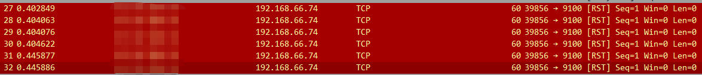
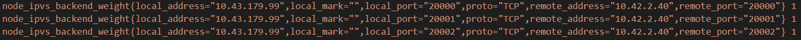

在 Grafana 中查看某一 job 中 target 的列表中缺少了一些节点，查看作为数据源的 Prometheus 的日志，

```shell
> scrape_pool=portal-proxy-server target=http://node1:9100/metrics msg="Scrape failed" err="context deadline exceeded"
> scrape_pool=portal-proxy-server target=http://node2:9100/metrics msg="Scrape failed" err="context deadline exceeded"
```

接着查看对应节点上的 node exporter 日志：

```shell
error encoding and sending metric family: write tcp 192.168.66.74:9100" msg="->x.x.x.x:41412: write: broken pipe"
```

配合抓包：



判断是 Prometheus 断开了连接，查看了网络没发现问题，但是使用 curl 访问节点上的 metrics 时，用时竟然达到了10s，这大大超过了我们设置的 scrape_timeout (2s)。这也说明了是抓取指标时超时(scrape_timeout>2s),Prometheus关闭了连接。

查看 metrics 返回的内容，发现了很多 ipvs 相关的指标。多个指标出现多次(label不同)：




通过修改node_exporter 启动 flags，过滤掉了不需要的label，大大减少了指标数量，从而缩短了metrics的获取时间。


参考文档：

1. https://github.com/prometheus/node_exporter/issues/1708
2. https://github.com/prometheus/node_exporter/pull/1709