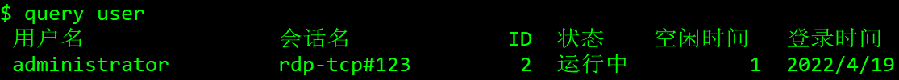
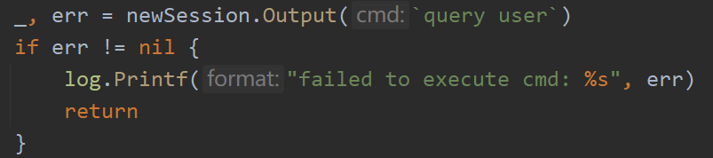
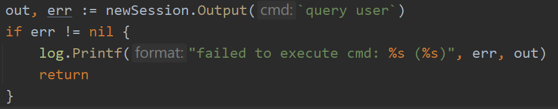
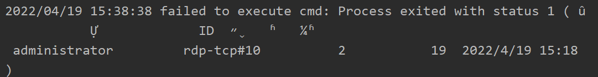
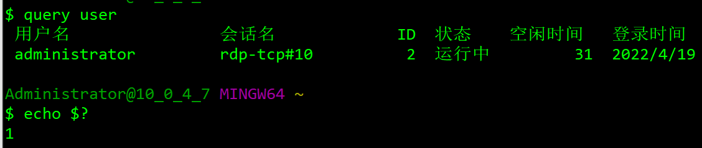

最近需要通过 SSH 远程连接执行命令，查看远程Windows Server 用户在线情况(query user)。

由于之前的远程服务器都是 Linux 所以一直没有遇到问题，直到遇到 Windows Server。

手动执行命令时，命令行回显正常。

但是通过代码 SSH 连接服务器执行命令时，却提示错误：

百思不得其解，然后再打印返回的标准输出的内容：

可以看到其实标准输出有我们预期的内容。

然后再在手动执行命令下方查看命令的退出码：

原来这里没有返回退出码0而是1，Windows 的这个操作令人疑惑。非0的退出码被 ssh 库当做错误处理

根据实际需求，我使用在命令后面添加管道和 grep 命令来规避并跳过这个坑